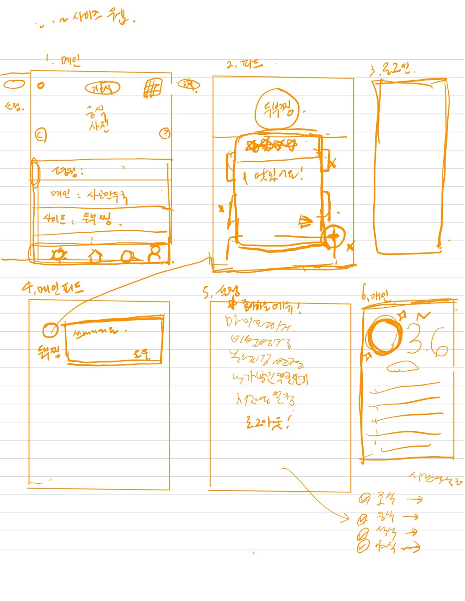

09/20 (화요일) 첫번째 프로젝트 모임을 가졌다. 
프로젝트는 총 3인이서, Sundou94님은 백엔드 프레임워크를, 
dbrdltmf님은 DB 설계 및 보안, 그리고 크롤링을 담당해주시고 
저 show5116은 프론트 엔드를 주로 담당하여서 프로젝트 역할분담을 하였다.

프로젝트 주제는 SK 하이닉스 식단표를 크롤링 하여서 웹 앱을 만드는 것을 목표로 한다.

백엔드는 Spring Cloud를 활용해, Micro Service Architecture로 구현하고, 
프론트 엔드는 Next Js를 활용하여 프로젝트를 설계하였다.

## Sketch

위의 이미지는 첫 회의에서 요구사항을 구두로 정리하여, 
구현할 페이지를 간단히 스케치 하여서 그렸다.

향후 1주일에 한번씩 모여서 스터디를 진행하기로 하였고, 
이 블로그를 만들어서 스터디 진행상황을 기록하기로 하였다.

